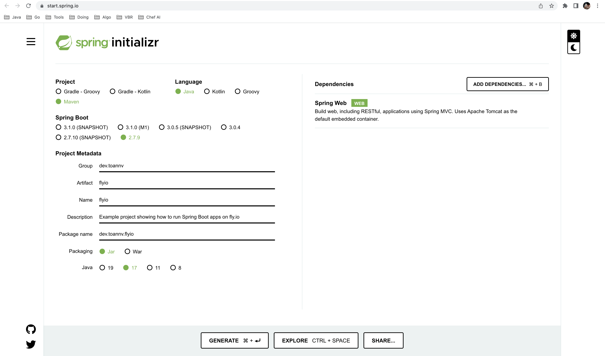
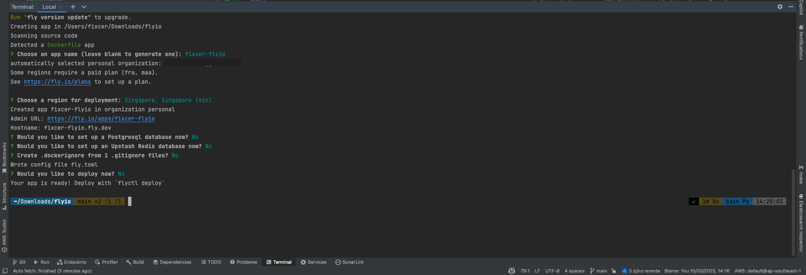
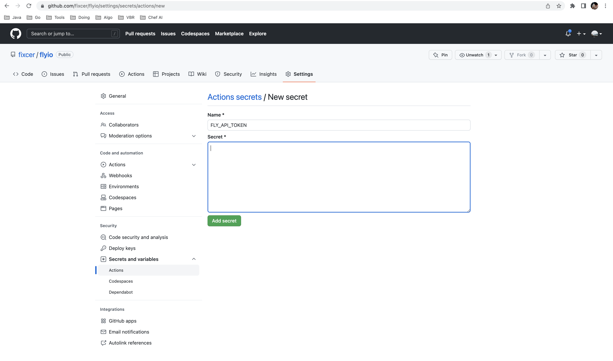
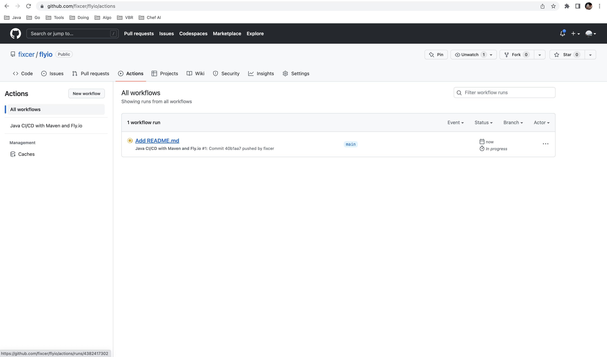
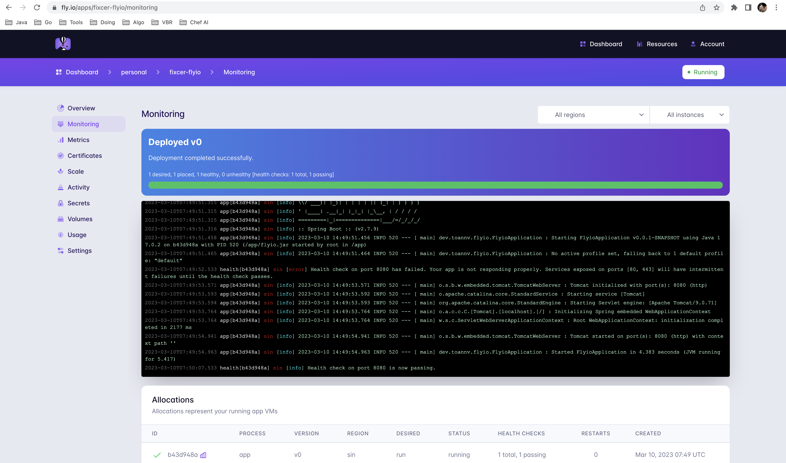

# flyio
[](https://github.com/fixcer/flyio/actions/workflows/deployment.yaml)

Example project showing how to run Spring Boot apps on https://fly.io/

You can find the code at [Github](https://github.com/fixcer/flyio)

## Why

To deploy a backend service for demo or personal purposes, a platform is essential. However, the popular platform Heroku is becoming increasingly costly. 

This may require individuals or businesses to explore alternative options that are more affordable.

## HowTo

So why not start using fly.io by checking out their hands-on guide at https://fly.io/docs/hands-on/

### Build example Spring Boot app with Dockerfile

As stated in https://fly.io/docs/hands-on/launch-app/

> Fly.io allows you to deploy any kind of app as long as it is packaged in a Docker image. That also means you can just deploy a Docker image and as it happens we have one ready to go in flyio/hellofly:latest.

That means you can use the proposed command `flyctl launch --image flyio/hellofly:latest` - but this would only launch a pre-build app based on the fly.io image flyio/hellofly https://hub.docker.com/r/flyio/hellofly

But as we want to use our own Spring Boot project at https://github.com/fixcer/flyio we need to create a Docker image first. 

Spring Boot project is created by using https://start.spring.io/ with the following dependencies:


In the root of our project we can create a `Dockerfile` like this:

```dockerfile
# Base image
FROM openjdk:17-jdk-slim

# Keep consistent with pom.xml
ENV APP_JAR_NAME flyio

RUN mkdir /app

ADD ./target/flyio.jar /app/

WORKDIR /app

# Expose port
EXPOSE 8080

ENTRYPOINT ["java", "-Duser.timezone=Asia/Saigon", "-jar", "flyio.jar"]
```

**Note:** By default, when running mvn package, the Spring Boot Maven Plugin generates a fat jar named ${name}-${version}.jar, with ${name} and ${version} values taken from the pom.xml file. However, it is possible to configure the pom.xml file to generate a jar file with a different name that corresponds to the application name.

For more information on this topic, please refer to this link: https://stackoverflow.com/questions/9593473/how-to-build-maven-project-without-version.


### Install flyctl

https://fly.io/docs/hands-on/install-flyctl/

On a Mac install flyctl via brew:

```shell
brew install flyctl
```


### Signup or login to fly.io

https://fly.io/docs/hands-on/sign-up/ or https://fly.io/docs/hands-on/sign-in/

```shell
fly auth signup
```


### Configure flyctl

In the terminal we can run `fly launch` to start the interactive configuration process.

You can set app name, region, etc. and then flyctl will generate a `fly.toml` file for you. This file is used to configure your app and is used by the flyctl CLI.



Then, we can add `builder` để build image từ Dockerfile:

```toml
[build]
  builder = "Dockerfile"
```

### Setup GitHub Actions

We want to build our Spring Boot app and push the Docker image to GitHub Container Registry. For that we need to create a GitHub Actions workflow in [.github/workflows/deployment.yaml](.github/workflows/deployment.yaml) that will be triggered on every push to the main branch.

```yaml
name: Java CI/CD with Maven and Fly.io

on:
    push:
        branches: [ master, main ]

    workflow_dispatch:

jobs:
    deploy:
        runs-on: ubuntu-latest
        steps:
            -   name: Checkout the repo
                uses: actions/checkout@v3

            -   name: Set up JDK 17
                uses: actions/setup-java@v3
                with:
                    java-version: '17'
                    distribution: 'adopt'
                    cache: maven

            -   name: Build with Maven
                run: mvn clean package

            -   name: Deploy our Spring Boot app to fly.io
                uses: superfly/flyctl-actions/setup-flyctl@master
            -   run: flyctl deploy --remote-only
                env:
                    FLY_API_TOKEN: ${{ secrets.FLY_API_TOKEN }}
```

As you can see we need to set the `FLY_API_TOKEN` secret in the GitHub repository settings. To get the token we need to run `flyctl auth token` and copy the token.



### Deploy Spring Boot app to fly.io

Now we can push our changes to the main branch and watch the GitHub Actions workflow running. After a few minutes our Spring Boot app should be deployed to fly.io.




### Access our Spring Boot app on fly.io

Finally, our app should now be accessible to the public: https://fixcer-flyio.fly.dev/




Now that's pretty cool!
